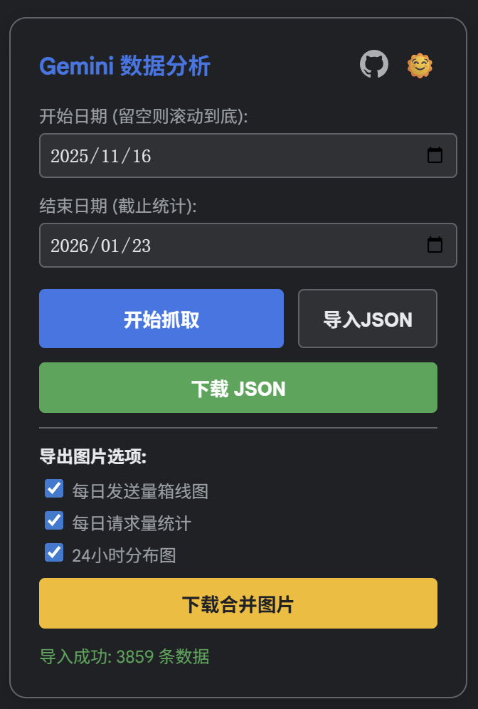
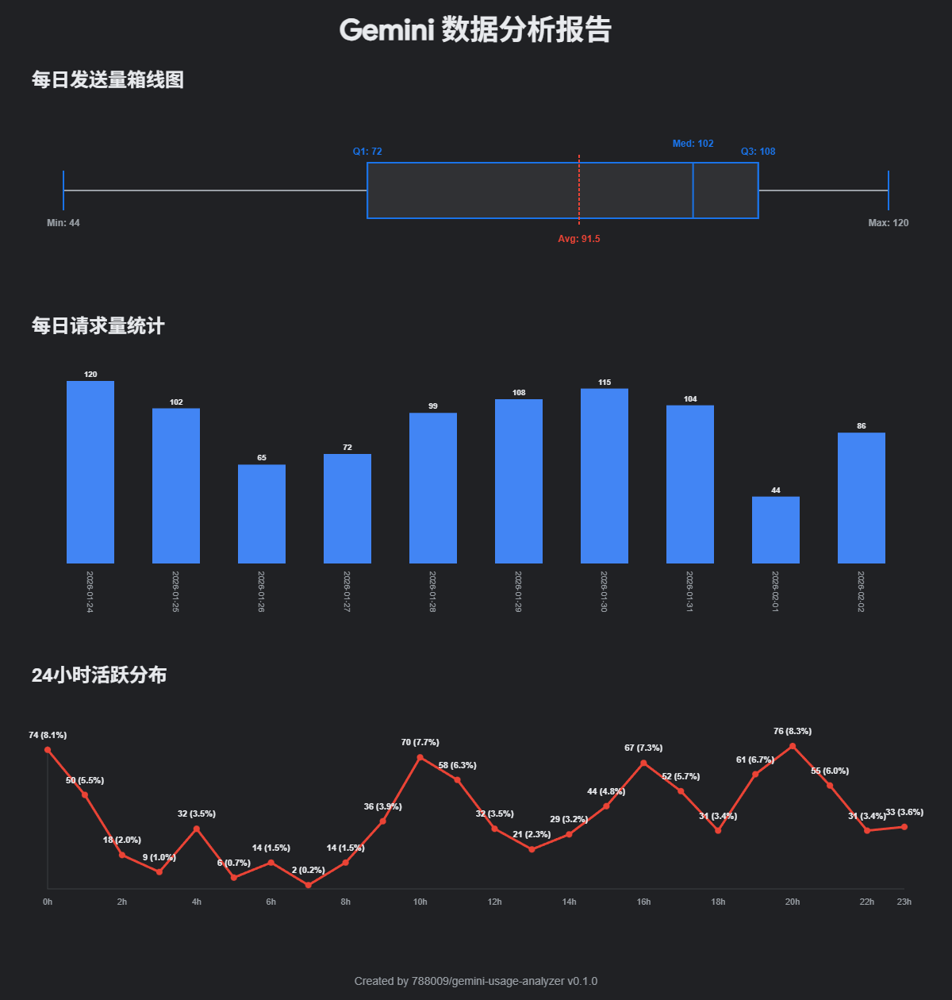

# Gemini Usage Analyzer

运行在 [Gemini 应用活动记录](https://myactivity.google.com/product/gemini) (Gemini Apps Activity) 页面的 Chrome 插件，用于获取并分析 Gemini 使用频率。

> [!TIP]
>
> **什么是 Gemini Apps Activity？**
>
> Gemini 应用活动记录记录了用户一定时间范围内向 Gemini 发送的所有消息，时间范围取决于用户设置。此功能默认开启。
>
> 你可以在 [Gemini](https://gemini.google.com/) 的`设置` → `活动记录`（`Setting & Help` → `Activity`）中打开这个页面。

## 功能

1. 自动滚动页面并获取数据。
2. 支持设置开始和结束日期。
3. 支持下载结果图片。
4. 支持下载 JSON 格式的原始数据，以便自行分析或直接给上传 AI 分析。

## 使用方法

0. 确保你开启了 Gemini 应用活动记录且有记录数据。
1. 从 [release](https://github.com/788009/gemini-usage-analyzer/releases) 下载最新版本的 Gemini Usage Analyzer 并解压。
2. 打开 [Chrome 扩展程序](chrome://extensions/) 页面，开启右上角开发者模式，然后点击`加载未打包的扩展程序`，选择解压得到的 `gemini-usage-analyzer-v{version}` 文件夹。
3. 此时扩展程序会自动启用，访问 [Gemini 应用活动记录](https://myactivity.google.com/product/gemini)页面即可看到插件界面。

## 截图

## 许可证

MIT Licence